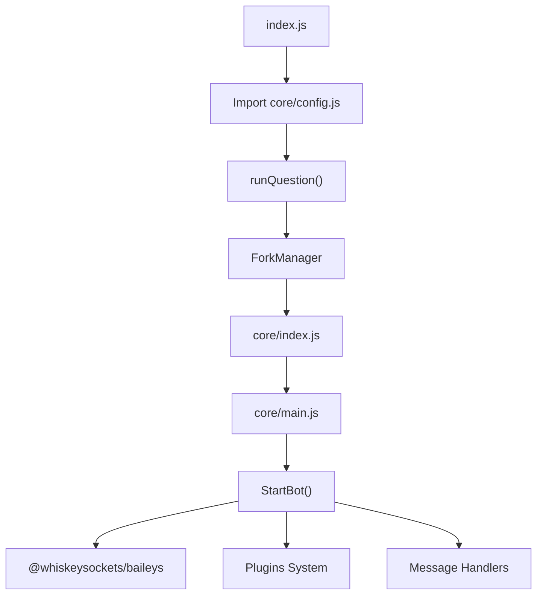

# Jun-Base

Jun-Base es un framework para bots de WhatsApp construido sobre Baileys que proporciona una base modular con sistema de roles, manejo de mensajes y arquitectura de plugins.

## Tabla de Contenidos
- [Arquitectura del Sistema](#arquitectura-del-sistema)
- [Configuración](#configuración)
- [Sistema de Roles](#sistema-de-roles)
- [Estructura de Archivos](#estructura-de-archivos)
- [Instalación y Ejecución](#instalación-y-ejecución)
- [Referencia de API](#referencia-de-api)

---

## Arquitectura del Sistema

### Flujo de Inicialización



El sistema utiliza una arquitectura de dos niveles con configuración separada entre aplicación y sistema core [1](#0-0) [2](#0-1) .

### Componentes Principales

- **index.js**: Punto de entrada que inicializa el proceso fork y maneja eventos de conexión [3](#0-2) 
- **core/main.js**: Lógica principal del bot incluyendo manejo de conexiones y eventos [4](#0-3) 
- **core/config.js**: Inicialización de variables globales del sistema [2](#0-1) 
- **config.js**: Configuración de la aplicación editable por usuario [1](#0-0) 

---

## Configuración

### Configuración de Aplicación (config.js)

Define settings configurables por el usuario a través del objeto `global.settings`:

```javascript
global.settings = {
    "setDBPort": 8000,
    "setServerIp": "",
    "mainBotStore": false,
    "mainBotNumber": "",
    "mainBotPrefix": ".¿?¡!#%&/,~@",
    "mainBotName": "@Jun",
    "mainBotAuto-read": true,
    "reactEmojis": {
        "waiting": "⌛",
        "success": "✔️", 
        "failure": "✖️"
    },
    "SetUserRoles": {
        "5216678432366": {
            "rowner": true,
            "owner": true,
            "modr": true,
            "prem": true
        }
    }
}
```

### Configuración Core (core/config.js)

Inicializa variables globales fundamentales:

| Variable | Propósito | Valor |
|----------|-----------|-------|
| `global.$package` | Contenido de package.json | JSON parseado [6](#0-5)  |
| `global.$dir_main` | Rutas de almacenamiento | Objeto con paths [7](#0-6)  |
| `global.db` | Instancia de base de datos | Desde library/db.js [8](#0-7)  |
| `global.$proto` | Protocolos WhatsApp | Desde Baileys [9](#0-8)  |

---

## Sistema de Roles

### Jerarquía de Roles

| Rol | Nivel | Descripción |
|-----|-------|-------------|
| `rowner` | 4 (máximo) | Root owner, privilegios más altos |
| `owner` | 3 | Bot owner, acceso administrativo |
| `modr` | 2 | Moderator, permisos elevados |
| `prem` | 1 | Premium, características especiales |

### Asignación de Roles

Los roles se configuran estáticamente en `global.settings.SetUserRoles` [10](#0-9)  y se asignan en tiempo de ejecución a través de `m.sender.js` [11](#0-10) :

```javascript
const rol = {
    rowner: m.sender.roles.bot ? true : roles?.rowner || false,
    owner: m.sender.roles.bot ? true : roles?.owner || false,
    modr: m.sender.roles.bot ? true : roles?.modr || false,
    prem: m.sender.roles.bot ? true : roles?.prem || false,
}
```

### Verificación de Roles

Los plugins pueden verificar roles usando:

```javascript
// Acceso directo
if (m.sender.roles.owner) {
    // ejecutar comando
}

// Función helper
if (await m.sender.role('owner', 'modr')) {
    // ejecutar si tiene owner o modr
}
```

---

## Estructura de Archivos

```
Jun-Base/
├── index.js                 # Punto de entrada
├── config.js               # Configuración de aplicación
├── package.json            # Metadatos y dependencias
├── core/
│   ├── config.js          # Configuración del sistema
│   ├── main.js            # Lógica principal del bot
│   └── handlers/
│       ├── m.sender.js    # Manejo de roles y usuarios
│       └── m.assign.js    # Utilidades de mensaje
├── library/
│   ├── db.js             # Abstracción de base de datos
│   ├── client.js         # Cliente WhatsApp
│   ├── plugins.js        # Sistema de plugins
│   └── ...
└── storage/
    ├── creds/            # Credenciales
    ├── store/            # Almacenamiento
    └── temp/             # Archivos temporales
```

---

## Instalación y Ejecución

### Dependencias Principales

El proyecto depende de [13](#0-12) :
- `@whiskeysockets/baileys`: Cliente WhatsApp
- `express`: Servidor web
- `dotenv`: Variables de entorno
- `qrcode`: Generación de códigos QR
- `chalk`: Colores en consola

### Scripts Disponibles

```json
{
  "scripts": {
    "start": "node index.js",
    "build": "npm install && node index.js"
  }
}
```

### Ejecución

1. Instalar dependencias: `npm install`
2. Configurar variables en `.env`
3. Iniciar: `npm start`

El sistema iniciará un proceso fork y mostrará el código QR para emparejar el dispositivo WhatsApp [15](#0-14) .

---

## Referencia de API

### Variables Globales

- `global.settings`: Configuración de la aplicación [16](#0-15) 
- `global.readMore`: Secuencia de caracteres para expandir mensajes [17](#0-16) 
- `global.db`: Instancia de base de datos [8](#0-7) 
- `global.$dir_main`: Rutas del sistema [7](#0-6) 

### Objeto Message (m)

El objeto `m` contiene información del mensaje y métodos:

```javascript
m.sender = {
    id: "ID del remitente",
    name: "Nombre del remitente", 
    number: "Número telefónico",
    roles: { rowner, owner, modr, prem, bot },
    role: async (...roles) => boolean,
    getDesc: async () => string,
    getPhoto: async () => Buffer
}
```

### Manejo de Errores

El sistema proporciona mensajes de error estandarizados a través de `m.sms(type)` [19](#0-18) :

- `m.sms('owner')`: "Este comando solo puede ser utilizado por un *propietario*"
- `m.sms('premium')`: "Esta solicitud es solo para usuarios *premium*"
- `m.sms('group')`: "Este comando solo se puede usar en *grupos*"

---
